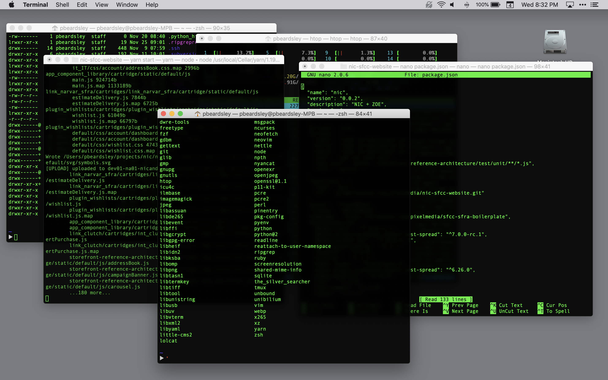
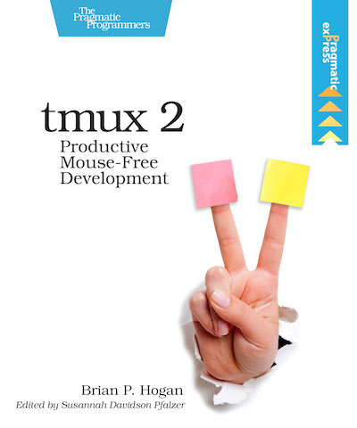

# What is TMUX?

##

- TMUX: Terminal Multiplexer
- Allows multiple terminal sessions within single window
- Decouples processes from actively running shell

# Why should I use it?

##

This used to be me:

##

### I also:

- Do a lot of stuff on the command line
- Switch around between several projects throughout the course of a day
- Hate starting in my home directory every time I open a new terminal

# Installation

- Mac: `brew install tmux`
- Ubuntu / WSL: `sudo apt-get install tmux`

# TMUX Concepts

##

- Pane: Single interactive session -- can be split within a window
- Window: Grouping of panes. Only one can be shown within terminal at a time
- Session: Grouping of windows. Similar to "project" in VS Code or Sublime

# Usage

##

Start a new session:

`tmux new -s mysession`

##

Split pane (vertical):

`Ctrl-b %`

##

Split pane (horizontal):

`Ctrl-b "`

##

Move between panes:

`Ctrl-b [arrow keys]`

##

Toggle zoom pane:

`Ctrl-b z`

##

Create a new window:

`Ctrl-b c`

##

Navigate between windows:

`Ctrl-b [window number]`

##

Detach session:

`Ctrl-b d`

##

List sessions:

`Ctrl-b s`

# Resources

##

### TMUX Book

##

- Reddit /r/tmux
